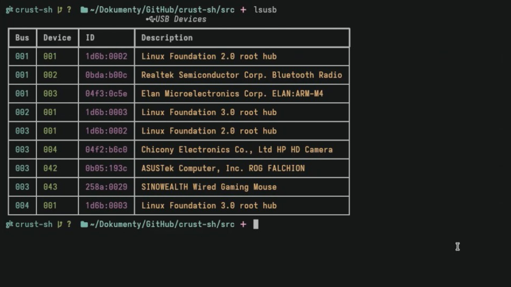

# 🐚 Crust Shell
[](https://www.python.org/downloads/)
[](https://kernel.org)
[]()
[](https://github.com/mostypc123)

Crust is an interactive Linux shell written in Python, designed with a modern interface, AI integration, and enhanced tooling for common system tasks.
Python devs, please add ✨**arrow support**✨ to `input()`.

## ✨ Features

- ⚙️ Custom startup hook support via `custom_commands.py`
- 🧠 AI Assistant integration using Cohere with `.question` prompt
- 🧾 Enhanced `ls`, `lsusb`, and `df -h` commands using Rich tables
- 🔧 Built-in troubleshooting interface
- 💾 Custom integration to search for packages across multiple package managers
- 📁 Git branch and repo detection in prompt
- 🪟 Venv support and styled prompt with icons
- 🧠 Neofetch context awareness for AI assistant

## 🖥️ Requirements and Installation

- Python 3.8+
- `rich`
- `cohere` (Python SDK)
- `neofetch` (Optional, helps the AI integrate better)

**Install dependencies:**

    pip install rich cohere

Make sure neofetch is installed and avalable in your PATH.

For now, no binaries are available for Crust. Crust will be later installable via any AUR helper and any PyPI package manager.

## 🚀 Usage

Start the shell:

    ```
    cd src
    python main.py
    ```

## 🧠 Ask the AI Assistant

Use `.question <your-question>` to ask anything about Linux, shell commands, or your environment.

**Example:**

    .question How do I list all open ports?

If the assistant suggests `.execute-command` or `.edit-file`, you’ll be asked to confirm.

## 🛠️ Built-in Commands

| Command         | Description                              |
|----------------|------------------------------------------|
| `capk <name>`   | Search for a package using `capk`        |
| `troubleshooting` | Run diagnostic and fix routines       |
| `about`         | Print shell info and version             |

All other commands fall back to system shell execution.

## 🔐 API Key

Create a file named `cohere-api-key.txt` in the project root and paste your Cohere API key into it:

    YOUR_API_KEY_HERE

## 📌 Notes

- Commands like `.execute-command` and `.edit-file` are scanned and optionally executed after AI responses.
- Neofetch output is provided to the AI to help it reason about your environment.
- Prompts like `.read-file` and `.edit-file` let the AI interact with real files on your system.

## 🛡️ License

This project is currently under development. License information will be provided in future versions.

## 📫 Contributing

Contributions, bug reports, and ideas are welcome!  
Feel free to open an issue or pull request on GitHub.

## 🧑‍💻 Author

**Juraj Kollár**  
Creator of [XediX](https://github.com/mostypc123/XediX)
